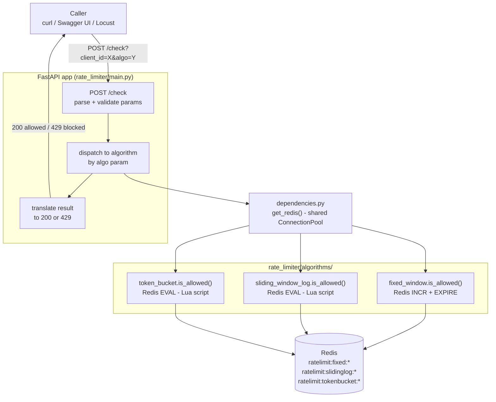
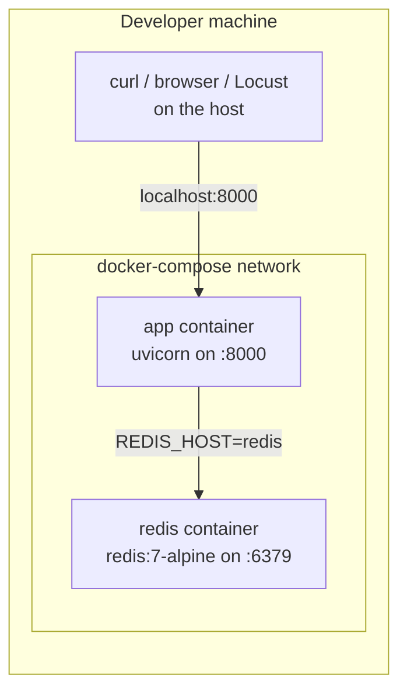

# Dev Log & Technical Notes

This is the detailed companion doc to the top-level [README](../README.md) —
project layout, full setup/testing/API reference, stage-by-stage progress,
and every bug or design decision worth remembering later. The main README
stays short; this file is where the details live and get updated as work
continues.

> **Status**: All 8 stages complete. Setup, all 3 algorithms with unit
> tests, FastAPI endpoint with integration tests, Locust load test proving
> atomicity under concurrency, full comparison + architecture writeup, and
> the service is Dockerized (`docker compose up -d --build` runs the whole
> thing). See [Progress](#progress) below.

---

## What this project actually does

This is **not** a protected API itself — it's a decision service. A real
gateway/proxy/backend would call `POST /check` before doing expensive work
for a given client, and reject the caller with `429` if the answer is "no."

```
client request
     │
     ▼
[ your gateway / backend ] ──POST /check?client_id=X&algo=Y──▶ [ this service ]
     │                                                                │
     │◀────────────────── 200 allowed / 429 blocked ─────────────────┘
     ▼
forward request to real backend (only if allowed)
```

Internally, each algorithm is a **pure function** — `is_allowed(redis_client,
key, ...) -> (bool, info)` — with no HTTP knowledge at all. The FastAPI layer
only parses the request, calls the right algorithm, and translates the
result into an HTTP status code. This separation is what makes each
algorithm independently unit-testable (see `tests/test_fixed_window.py`,
etc.) without spinning up a server.

## Architecture

Four layers, each with one job:

1. **Caller** — `curl`, the Swagger UI at `/docs`, or `load_test/locustfile.py`.
   Sends `POST /check?client_id=X&algo=Y[&limit=...|&capacity=...]`.

2. **`rate_limiter/main.py`** (FastAPI app) — parses and validates query
   params (`Literal["fixed_window", "sliding_window_log", "token_bucket"]`
   makes `algo` a hard-validated enum, not a free string), applies defaults,
   dispatches to the matching algorithm function, and translates the
   `(allowed, info)` result into `200` or `429`. No rate-limiting logic
   lives here — it's pure routing/translation.

3. **`rate_limiter/algorithms/*.py`** — one pure function per algorithm,
   `is_allowed(redis_client, key, ...) -> (bool, info)`. Each owns its own
   Redis key namespace (`ratelimit:fixed:`, `ratelimit:slidinglog:`,
   `ratelimit:tokenbucket:`) so the same `client_id` can be checked under
   different algorithms without collision. These functions know nothing
   about HTTP — they're called directly (no server needed) in
   `tests/test_*.py`, and through the API in `tests/test_api.py`.

4. **Redis** — the actual shared state. Every write that needs multi-step
   read-modify-write correctness runs as a **Lua script** via `EVAL`, so
   Redis executes it to completion with nothing else interleaved. Fixed
   Window's single `INCR` doesn't need a script — it's already atomic.

### Request flow (HLD)



### Deployment topology



Two Docker services, one Compose network: `app` reaches `redis` by
service name (Compose's built-in DNS), not `localhost` — `localhost`
inside the `app` container would point back at itself. The `REDIS_HOST`
env var (read in `dependencies.py`) is what makes the same code work both
containerized (`REDIS_HOST=redis`) and run directly on the host for
development (`REDIS_HOST` unset, defaults to `localhost`).

`dependencies.py` exists as its own module specifically so
`app.dependency_overrides` (used in `tests/test_api.py`) can redirect the
API to a test Redis DB without touching `main.py` — the standard FastAPI
pattern for making side effects swappable in tests.

## The three algorithms

| | Fixed Window Counter | Sliding Window Log | Token Bucket |
|---|---|---|---|
| **Redis structure** | 1 integer counter per client per time bucket | ZSET of request timestamps per client | Hash `{tokens, last_refill}` per client |
| **Atomicity mechanism** | Single `INCR` (already atomic, no script needed) | Lua script: evict old entries → count → conditionally add | Lua script: read state → compute refill → conditionally consume → write state |
| **Memory per client** | O(1) — one integer | O(limit) — one entry per request currently in the window | O(1) — two fields |
| **Work per check** | O(1) | O(evicted + limit) | O(1) |
| **Burst handling** | Up to 2x the limit can slip through across a window boundary — an *unintentional* artifact of aligning windows to wall-clock time | None beyond the configured limit — the window is measured continuously from "now," so there's no boundary to exploit | Burst up to `capacity`, then throttled to `refill_rate` — the *only* one of the three where burst tolerance is an intentional, independently tunable knob |
| **Accuracy** | Approximate — can admit ~2x the nominal rate at boundaries | Exact — always reflects the true request count in the trailing window | Exact for budget tracking, but answers a different question ("do you have budget?") rather than "how many requests in the last N seconds?" |
| **Best fit** | Coarse, cheap limits where occasional boundary bursts are acceptable (e.g. UI-facing throttling) | Limits with strict compliance requirements (e.g. contractual external API quotas) | General-purpose API rate limiting — this is what AWS, Stripe, and most gateways actually use, because it separates "burst tolerance" from "sustained rate" as two independent controls |
| **Verified by** | `tests/test_fixed_window.py` (6 tests) + Stage 6 load test | `tests/test_sliding_window_log.py` (6 tests) + Stage 6 load test | `tests/test_token_bucket.py` (6 tests) + Stage 6 load test |

A concrete memory comparison: at `limit=10,000`, Sliding Window Log stores
up to 10,000 sorted-set entries *per client* (each entry is a timestamp +
unique member string — easily hundreds of KB per active client), while
Fixed Window and Token Bucket each store a small constant number of fields
regardless of the limit. This is the real cost of Sliding Window Log's
accuracy, not a hypothetical one — see the Stage 6 load test results below
for what "under concurrent load" actually looks like for all three.

## Project layout

```
rate_limiter/
  algorithms/
    fixed_window.py        # is_allowed(client, key, limit, window_seconds, now_fn=time.time)
    sliding_window_log.py  # is_allowed(client, key, limit, window_seconds, now_fn=time.time)
    token_bucket.py        # is_allowed(client, key, capacity, refill_rate, now_fn=time.time)
  dependencies.py           # get_redis() -- FastAPI dependency, shared connection pool
  main.py                   # FastAPI app: GET /health, POST /check
tests/
  conftest.py               # shared `r` fixture (test Redis db=15) + make_clock() fake-clock helper
  test_fixed_window.py
  test_sliding_window_log.py
  test_token_bucket.py
  test_api.py               # end-to-end tests via FastAPI TestClient
load_test/
  locustfile.py             # Locust load test proving atomicity under concurrency
Dockerfile                  # builds the app image (rate_limiter/ + requirements.txt only)
docker-compose.yml          # `docker compose up -d` starts Redis + the app together
.dockerignore                # keeps venv/, tests/, docs/ etc. out of the image build context
requirements.txt            # runtime deps only (fastapi, uvicorn, redis) -- what ships in the image
requirements-dev.txt        # requirements.txt + pytest/httpx/locust, for local dev/testing
```

Every algorithm module accepts an injectable `now_fn` (defaults to
`time.time`), which is what lets tests simulate window rollover / token
refill deterministically and instantly, instead of using real `time.sleep()`
and risking flaky, slow tests.

## Setup

There are two ways to run this locally, depending on what you're doing.

### Option A -- everything in Docker (fastest way to just see it working)

```bash
docker compose up -d --build       # builds the app image, starts Redis + the app together
curl http://localhost:8000/health
```

`docker-compose.yml` defines two services: `redis` (the official
`redis:7-alpine` image) and `app` (built from the local `Dockerfile`). The
app container reaches Redis via the hostname `redis` -- Compose gives each
service a DNS entry on the network it creates, which is why
`rate_limiter/dependencies.py` reads the Redis host from a `REDIS_HOST` env
var (defaulting to `localhost` for non-Docker use) instead of hardcoding it.
`docker-compose.yml` sets `REDIS_HOST=redis` for the `app` service.

### Option B -- Python running on the host, Redis in Docker (for development/testing)

This is what every earlier stage in this log used, and is still the right
setup for running tests, using `--reload`, or debugging in an IDE.

```bash
python -m venv venv
source venv/Scripts/activate        # Windows Git Bash; use venv\Scripts\Activate.ps1 in PowerShell
python -m pip install --upgrade pip
pip install -r requirements-dev.txt # includes pytest/httpx/locust on top of the runtime deps

docker compose up -d redis          # starts only Redis -- skips building/starting the app container
uvicorn rate_limiter.main:app --reload --port 8000
```

`requirements.txt` intentionally holds only what the running service
needs (fastapi, uvicorn, redis) -- that's what gets installed inside the
Docker image. `requirements-dev.txt` layers testing/load-testing tools on
top for local development; keeping them separate means the shipped image
doesn't carry pytest/locust it'll never use.

## Running the tests

```bash
source venv/Scripts/activate
python -m pytest tests/ -v
```

All algorithm and API tests run against a **real Redis instance** on a
dedicated test DB (`db=15`, flushed before/after each test) rather than a
mock — a rate limiter's entire job is correctness under Redis's actual
atomicity guarantees, which a mock would paper over. (Tests run against the
Python code directly/via FastAPI's `TestClient`, not the Docker image --
there's no need to rebuild a container to run the test suite.)

## Running the API

```bash
uvicorn rate_limiter.main:app --reload --port 8000
```

### `GET /health`

```bash
curl http://localhost:8000/health
# {"status": "ok"}
```

### `POST /check`

Checks whether `client_id` is allowed one more request under `algo`.
Returns `200` (allowed) or `429` (blocked).

Every response carries standard rate-limit headers so a real gateway/backend
can act on the decision without re-deriving it:

| Header | Meaning |
|---|---|
| `X-RateLimit-Limit` | The effective `limit` (fixed_window/sliding_window_log) or `capacity` (token_bucket) used for this check |
| `X-RateLimit-Remaining` | Requests (or tokens) left in the current window/bucket |
| `X-RateLimit-Reset` | Seconds until quota next changes in the caller's favor -- window rollover for Fixed Window, the oldest entry aging out for Sliding Window Log, or the next token becoming available for Token Bucket. Always an integer, rounded up (`math.ceil`) so callers never retry a moment early |
| `Retry-After` | Same value as `X-RateLimit-Reset`, only present on `429` responses -- this is the standard HTTP header (RFC 7231) most HTTP clients/gateways already know how to honor |

Each algorithm's `is_allowed()` now returns a 3-tuple --
`(allowed, count_or_tokens, reset_seconds)` -- instead of 2, so `main.py`
never has to recompute timing separately from the atomic Redis operation
that made the decision (which would risk a slightly different `now` than
the one actually used inside the Lua script/`INCR`).

| Param | Applies to | Default | Meaning |
|---|---|---|---|
| `client_id` | all | *(required)* | Identifies the caller being rate-limited |
| `algo` | all | `token_bucket` | `fixed_window` \| `sliding_window_log` \| `token_bucket` |
| `limit` | fixed_window, sliding_window_log | `5` | Max requests per window |
| `window_seconds` | fixed_window, sliding_window_log | `10` | Window size in seconds |
| `capacity` | token_bucket | `5` | Max burst size (bucket size) |
| `refill_rate` | token_bucket | `0.5` | Tokens added per second (sustained rate) |

Defaults are deliberately small so you can observe blocking within a few
seconds of manual testing — they are not meant to look like production
values.

```bash
# Fire 6 requests at a limit of 5 -- the 6th should come back 429
for i in 1 2 3 4 5 6; do
  curl -s -o /tmp/resp.json -w "%{http_code}\n" -X POST \
    "http://localhost:8000/check?client_id=demo&algo=fixed_window&limit=5&window_seconds=10"
  cat /tmp/resp.json; echo
done
```

Each `algo` namespaces its own Redis keys
(`ratelimit:fixed:`, `ratelimit:slidinglog:`, `ratelimit:tokenbucket:`), so
the same `client_id` can be checked against multiple algorithms
independently without interference.

## Load testing

`load_test/locustfile.py` runs many simulated users against `POST /check`
concurrently — the point being to prove the Redis-side atomicity (`INCR`,
Lua scripts) holds under real concurrent load, not just sequential test
calls. All simulated users deliberately hit the **same `client_id`**, since
the interesting failure mode is over-admission when many requests race to
check the same counter at once, not raw server throughput.

`window_seconds` / `capacity` are set large relative to the run duration so
the window/bucket can't roll over mid-test — that keeps the assertion
clean: **total requests allowed must never exceed the configured limit.**

```bash
locust -f load_test/locustfile.py --host=http://localhost:8000 \
  --headless --users 100 --spawn-rate 100 --run-time 5s \
  --algo fixed_window --limit 50 --window-seconds 60
```

Custom `--algo` / `--limit` / `--window-seconds` / `--capacity` /
`--refill-rate` CLI args (added via `events.init_command_line_parser`) let
the same locustfile drive any of the three algorithms. A `request` event
listener tallies 200s vs 429s (both are *correct* outcomes here — Locust's
default "4xx = failure" behavior is overridden per-request via
`catch_response=True`), and a `test_stop` listener prints a pass/fail
summary comparing the allowed count against the configured limit.

### Results (100 concurrent users, 5s run, limit/capacity = 50)

| Algorithm | Total requests | Allowed | Blocked | Over limit? |
|---|---|---|---|---|
| fixed_window | 1475 | 50 | 1425 | No |
| sliding_window_log | 1146 | 50 | 1096 | No |
| token_bucket (refill_rate=0.001, negligible over 5s) | 1381 | 50 | 1331 | No |

In every run, the allowed count landed **exactly** on the configured limit
despite well over a thousand requests racing for it concurrently — direct
evidence that the atomic Redis operations are doing their job under load,
not just in sequential unit tests.

One caveat worth being explicit about: Locust runs simulated users as
gevent greenlets cooperatively scheduled on a single OS thread (in this
default, non-`--processes` mode), so the client side isn't true OS-level
parallelism. The concurrency that actually matters here is server-side —
uvicorn/FastAPI has many requests in flight to Redis at once — and that's
real regardless of how the client generates the load.

## Progress

| Stage | What | Status |
|---|---|---|
| 1 | Project setup: venv, requirements, Redis via Docker | Done |
| 2 | Fixed Window Counter + unit tests | Done |
| 3 | Sliding Window Log + unit tests | Done |
| 4 | Token Bucket + unit tests | Done |
| 5 | FastAPI `POST /check` endpoint + integration tests | Done |
| 6 | Load-testing script proving the limiter actually blocks | Done |
| 7 | README comparison table + architecture diagram writeup | Done |
| 8 | Dockerize the service | Done |

All 8 stages complete.

### Known gaps / things called out along the way

- `fixed_window.py` originally passed a `float` `window_seconds` straight to
  Redis `EXPIRE` (which requires an integer) — worked in unit tests (which
  always used `int`), broke once the API passed floats from query params.
  Fixed with `math.ceil()`. A good example of a bug that only surfaces at
  integration time, not unit-test time.
- `limit`, `window_seconds`, `capacity`, and `refill_rate` are now validated
  as strictly positive via FastAPI `Query(gt=0)` constraints, so e.g.
  `limit=-5` or `window_seconds=0` gets a `422` instead of reaching the
  algorithm layer. Covered by `tests/test_api.py`.
- Token Bucket's Redis key TTL (`capacity / refill_rate + 1` seconds) is a
  cleanup heuristic, not a strict correctness guarantee.
- The Dockerized `app` service has no `--reload` and isn't meant for active
  development — it's the "ship this" path. Local development still runs
  `uvicorn` directly on the host (Option B in Setup) against a Dockerized
  Redis, so code changes take effect immediately.
- No persistent volume for Redis in `docker-compose.yml` — `docker compose
  down` wipes all rate-limit state. Intentional: this is ephemeral counter
  data by nature, not something that needs to survive a restart.
